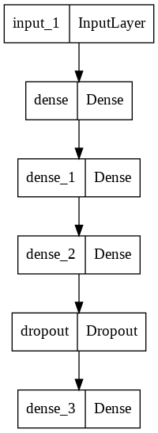
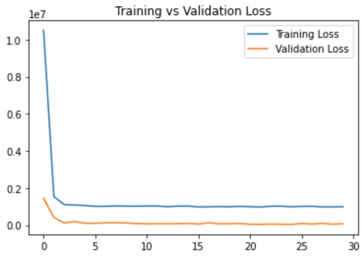
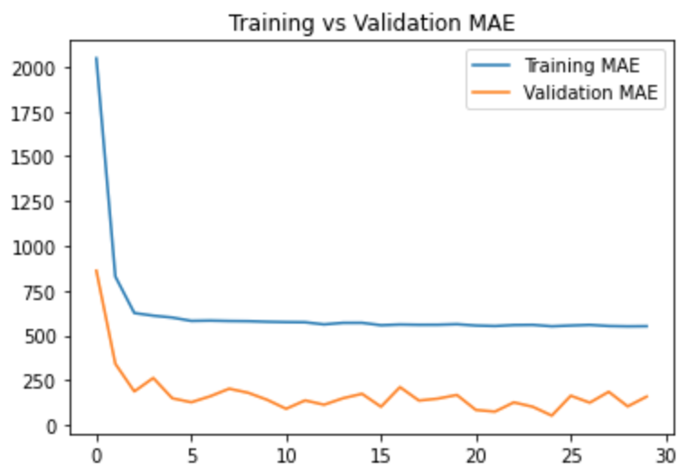
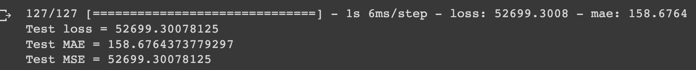
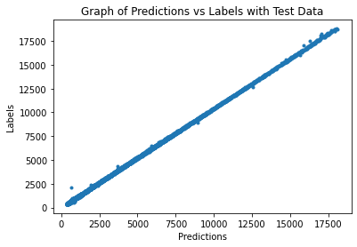

# Diamond-Price-Prediction
##1. Summary
The aim of this project was to create an accurate model that would predict the price of a diamond based on the following:
- the 4Cs (cut / clarity / carat / color)
- dimensions 
- depth

[This](https://www.kaggle.com/datasets/shivam2503/diamonds) dataset was used for the project.

## 2. IDE and Framework
This project was coded in Google Colab. The main frameworks used were Pandas, Numpy, Scikit-learn and TensorFlow Keras.

## 3. Methodology
### 3.1. Data Pipeline
The data was loaded and preprocessed, removing unwanted features and categorical features were encoded ordinally. Then the data was split 70:15:15 into train / validation / test sets.

### 3.2. Model Pipeline
I constructed a simple feed-forward neural network for the purposes of a regression problem. The structure of the model is fairly simple. The figure below shows a simply structure of the model.

The model is trained with a batch size of 64 and for 100 epochs. Early stopping is applied in this training. The training stops at epoch 25, with a training MAE of 736 and validation MAE of 535. The two figures below show the graph of the training process, indicating the convergence of model training.

 

## 4. Results
The figure below shows the performance of the model on our set-aside test data. 

We also used a model to make a prediction with test data. The result of the prediction is shown below.

The graph shows a very clear trendline of y=x, indicating the predictions and labels perform very similarly. 1 or 2 outliers can be spotted outside of the trendline. 
